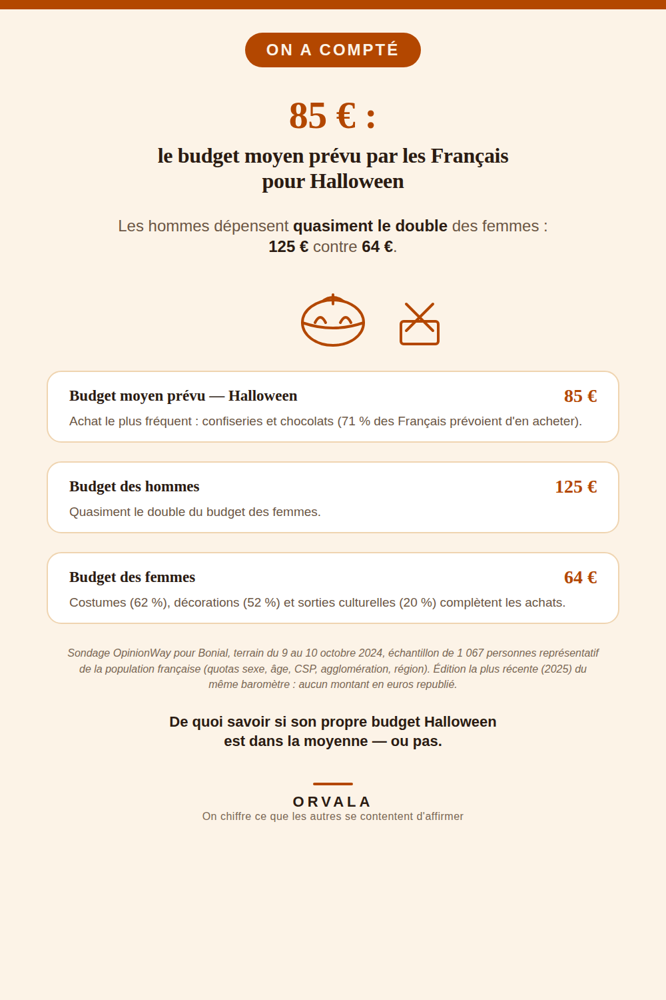

# Combien coûte Halloween ?

**85 €** : c'est le budget moyen prévu par les Français pour Halloween. Les hommes dépensent
quasiment le double des femmes — **125 €** contre **64 €**.

## Ce qui est mesuré

| Indicateur | Chiffre |
|---|---|
| Budget moyen prévu — Halloween | **85 €** |
| Budget moyen — hommes | **125 €** |
| Budget moyen — femmes | **64 €** |
| Prévoient d'acheter des confiseries/chocolats | **71 %** |
| Prévoient d'acheter un costume | **62 %** |
| Prévoient d'acheter de la décoration | **52 %** |
| Prévoient une sortie culturelle liée à Halloween | **20 %** |
| Produits culturels (films, livres…) | **19 %** |
| Autres produits alimentaires | **13 %** |

## La source

Sondage **OpinionWay pour Bonial**, terrain du **9 au 10 octobre 2024**, échantillon de
**1 067 personnes** représentatif de la population française (quotas sexe, âge, catégorie
socioprofessionnelle, catégorie d'agglomération, région). Publié en octobre 2024.

Page source vérifiée directement (WebFetch, 2026-08-11) :
https://corporate.bonial.com/communique-de-presse/halloween-2024-les-hommes-depenseront-le-double-des-femmes

## Ce qui manque, honnêtement

Cette étude date d'**octobre 2024**, pas de 2025 ou 2026. Une édition 2025 du même baromètre
existe (publiée le 23/10/2025, échantillon de 10 080 répondants) mais elle ne communique **aucun
montant en euros** — uniquement des taux d'intention d'achat. Le chiffre en euros le plus récent
et sourcé disponible reste donc celui de 2024 : ce n'est pas un chiffre recyclé sous une fausse
étiquette d'année récente, c'est un chiffre honnêtement daté faute de mieux.

Les pourcentages par poste d'achat ne totalisent pas 100 % : ce sont des intentions d'achat
(plusieurs réponses possibles), pas une répartition d'un budget total — la source ne prétend pas
le contraire, et ce dépôt ne recalcule rien au-delà de ce qu'elle publie.

## À propos

Ce dépôt accompagne une épingle Pinterest (compte `orvaladigital`) qui reprend ces chiffres pour
les rendre visibles à celles et ceux qui veulent situer leur propre budget Halloween par rapport à
la moyenne mesurée — pas pour donner un conseil d'économie.

Ce dépôt fait partie d'une série qui chiffre et source ce que les autres se contentent
d'affirmer, un sujet à la fois — [voir l'index complet](https://github.com/VincentChabran/VincentChabran) :

- [783 €/an pour un chien, 571 €/an pour un chat](https://github.com/VincentChabran/combien-coute-un-chien-un-chat)
- [19 293 € : le budget moyen d'un mariage en France](https://github.com/VincentChabran/combien-coute-un-mariage)
- [1 239,56 € : le coût de revient d'un déménagement de 27 m³](https://github.com/VincentChabran/combien-coute-un-demenagement)
- [488 € : le budget d'une rentrée scolaire 2026](https://github.com/VincentChabran/combien-coute-une-rentree-scolaire)
- [1 748 € : le budget des vacances d'été 2026](https://github.com/VincentChabran/combien-coutent-des-vacances-ete)
- [491 € : le budget de Noël 2025](https://github.com/VincentChabran/combien-coute-noel)
- [490 €/mois : le budget d'un bébé de 0 à 3 ans](https://github.com/VincentChabran/combien-coute-un-bebe)
- [154 € : le budget cadeau moyen chez les couples qui fêtent la Saint-Valentin](https://github.com/VincentChabran/combien-coute-la-saint-valentin)
- [77 € vs 76 € : le même budget cadeau pour la Fête des Mères et des Pères](https://github.com/VincentChabran/combien-coute-la-fete-des-meres-et-des-peres)

